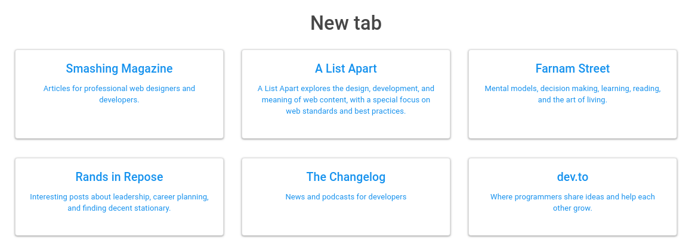

# @ryaninvents/newtab

Chrome "New Tab" page



## Why?

1. I wanted to see how hard it would be -- turns out it's not that complicated.
2. I wanted to make sure that if I'm going to get distracted, I might as well read something worthwhile.
3. I wanted somewhat of a template, in case I get a really good idea for a Chrome extension in the future.

## Building

```
npm install
npm run keygen
npm run build
```

## Installing in Chrome

Visit [chrome://extensions](chrome://extensions). After you've built the extension, drag `newtab.crx` into the extensions window. (You may need to click the extensions window to give it focus before dragging; I experienced a bit of weirdness on Linux with this.)

## License

MIT